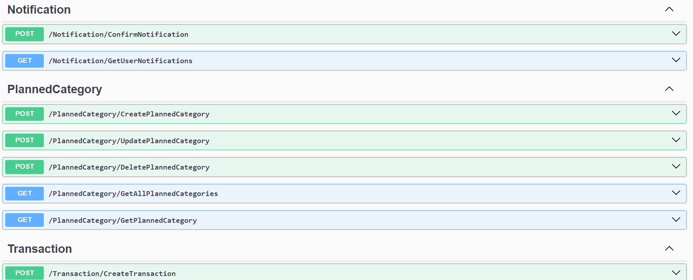

# Home Budget Project

## How to Run
1. Clone the repository.
2. Open the solution in Visual Studio or your preferred IDE.
3. Restore NuGet packages.
4. Update the `appsettings.json` file with your configuration settings (e.g., connection string, JWT settings).
5. Build and run the project. The WebAPI will be hosted locally.
6. Use Swagger (available at `/swagger`) to explore and test the API endpoints.

## Features
The Home Budget project is a robust ASP.NET Core 8.0 WebAPI application designed to manage personal budgeting and financial tracking. Below are the key features:

## Application preview

## About the API
This API is designed in a **Remote Procedure Call (RPC)** style, allowing clients to invoke remote functions seamlessly. 

1. **CQRS Architecture**  
   The project is built following the CQRS (Command Query Responsibility Segregation) pattern. It separates the logic for reading data (queries) from the logic for modifying data (commands), ensuring scalability and clear separation of concerns.

2. **Entity Framework Core with Caching**  
   Entity Framework Core is used as the ORM for data access, with a caching mechanism integrated to enhance performance. Cached data prevents unnecessary database queries, improving response times for frequently accessed information.

3. **Fluent Validation for Request Validation**  
   All incoming requests are validated using Fluent Validation. This ensures that data passed into the API is consistent and avoids processing invalid inputs.

4. **Logging with Serilog**  
   Serilog is used to log application processes, errors, and general information. It provides an extensible logging framework that allows for detailed logging across multiple sinks (e.g., file, database).

5. **Business Logic with MediatR**  
   The application uses MediatR to manage its business logic through handlers. This provides a clean implementation of the CQRS pattern, ensuring that commands and queries are processed correctly.

6. **Event Handling**  
   Custom event handlers are implemented to react to various system events, allowing the application to handle specific actions triggered by external or internal events.

7. **Exception and Error Handling**  
   Global exception handling has been implemented to manage and standardize error responses from the API, ensuring that all API failures return meaningful error messages and HTTP status codes.

8. **JWT Authentication with Cookie Storage**  
   Authentication is handled using JWT (JSON Web Tokens). Tokens are stored securely in cookies, ensuring that the user session is managed safely and efficiently.

9. **User Account Management**  
   The application provides registration, login, and logout functionality, allowing users to create and manage their accounts securely.

10. **Clean Architecture**  
    The application is built following the principles of Clean Architecture. It is divided into separate layers for Application, Domain, Infrastructure, and Presentation, ensuring maintainability and testability.

11. **API Documentation with Swagger**  
    Swagger is integrated to provide easy access to the API documentation. It allows for interactive testing and exploration of the API endpoints.

12. **CORS Configuration**  
    Cross-Origin Resource Sharing (CORS) has been configured to allow frontend applications to interact securely with the API.

13. **Anti-Forgery Token Protection**  
    To secure sensitive operations, anti-forgery tokens are used to prevent Cross-Site Request Forgery (CSRF) attacks.

14. **Notification Service**  
    A notification service has been implemented to monitor budget thresholds. When a user exceeds a set category limit, notifications are generated and displayed.

15. **Multiple Controllers**  
    Several controllers manage different features of the system:
   - `BudgetController`: Handles budget-related commands and queries.
   - `CategoryController`: Manages category data, including limit tracking.
   - `TransactionController`: Handles all operations related to transactions.
   - `NotificationController`: Responsible for notifications related to budget and transaction events.

## Future Enhancements
Planned future features include:

- **Forgotten Password Recovery**  
   Users can request a password change.

- **OAuth 2.0 Authorization**  
   Users can login to the app via e.g GoogleAccount.

- **Exportable CSV Reports**  
   Users will have the ability to generate and download budget and transaction reports in CSV format.

- **Subcategories under Categories**  
   Users will be able to create subcategories within existing categories to improve organization and navigation.